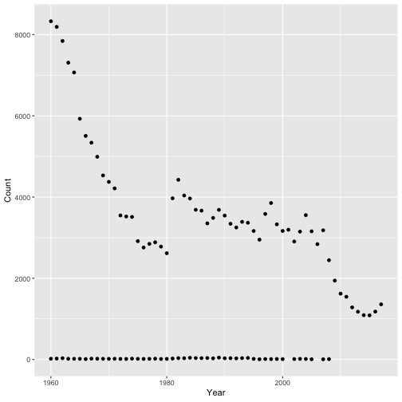
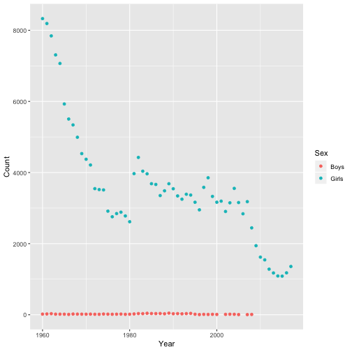
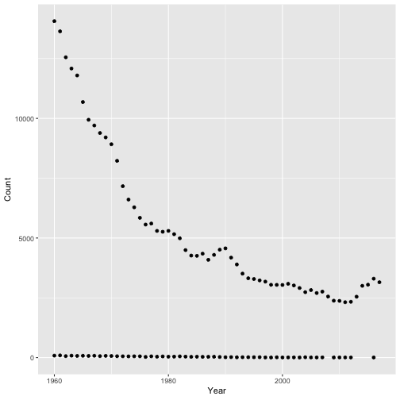
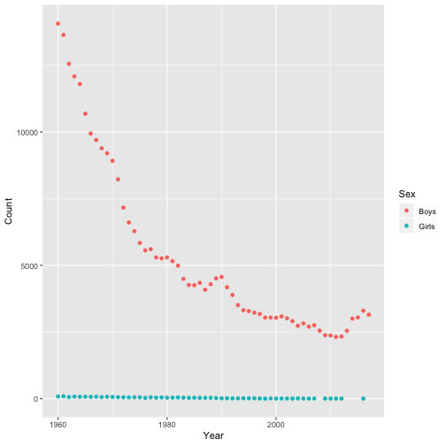
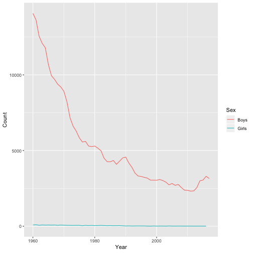
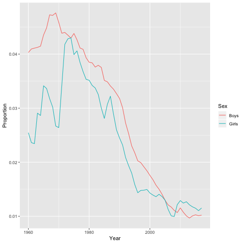
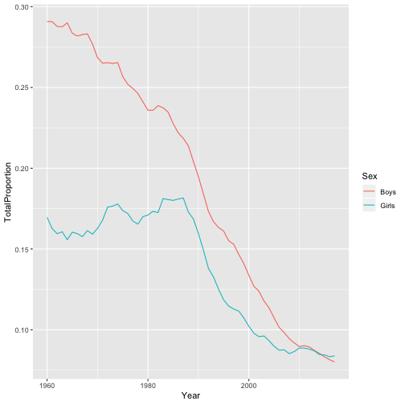

Welcome
========

Materials and setup 
-------------------

**NOTE: skip this section if you are not running R locally** (e.g., if you are
running R in your browser using a remote Jupyter server)

You should have R installed --if not:

-   Download and install R from http://cran.r-project.org
-   Download and install RStudio from https://www.rstudio.com/products/rstudio/download/#download

Notes and examples for this workshop are available at 
[](http://tutorials.iq.harvard.edu/R/Rintro/Rintro.html)

Start RStudio create a new project:
-   On Windows click the start button and search for rstudio. On Mac
    RStudio will be in your applications folder.
-   In RStudio go to `File -> New Project`.
-   Choose `New Directory` and `New Project`.
-   Choose a name and location for your new project directory.

Workshop goals and approach
---------------------------

In this workshop you will

-  learn R basics,
-  learn about the R package ecosystem,
-  practice reading files and manipulating data in R

A more general goal is to get you comfortable with R so that it seems less scary and mystifying than it perhaps does now. Note that this is by no means a complete or thorough introduction to R! It's just enough to get you started.

This workshop is relatively informal, example-oriented, and hands-on. We won't spend much time examining language features in detail. Instead we will work through an example, and learn some things about the R  along the way.

As an example project we will analyze the popularity of baby names in the US from 1960 through 2017. Among the questions we will use R to answer are:

-  In which year did your name achieve peak popularity?
-  How many children were born each year?
-  What are the most popular names overall? For girls? For Boys?


Graphical User Interfaces (GUIs)
================================

There are many different ways you can interact with R. See the
[Data Science Tools workshop notes](http://tutorials.iq.harvard.edu/Other/DataScienceTools/DataScienceTools.html) 
for details.

For this workshop we encourage you to use RStudio; it is a good R-specific IDE that mostly just works.

Launch RStudio (skip if not using RStudio)
------------------------------------------
**Note: skip this section if you are not using Rstudio (e.g., if you are running these examples in a Jupyter notebook).**

-   Start the RStudio program
-   In RStudio, go to **File -> New File -> R Script**

The window in the upper-left is your R script. This is where you will
write instructions for R to carry out.

The window in the lower-left is the R console. This is where results
will be displayed.

Exercise 0
----------

The purpose of this exercise is to give you an opportunity to explore
the interface provided by RStudio (or whichever GUI you've decided to
use). You may not know how to do these things; that's fine! This is an
opportunity to figure it out.

Also keep in mind that we are living in a golden age of tab completion.
If you don't know the name of an R function, try guessing the first two
or three letters and pressing TAB. If you guessed correctly the function
you are looking for should appear in a pop up!

-------------------------------------------

1.  Try to get R to add 2 plus 2.

```r
##
```
2.  Try to calculate the square root of 10.

```r
##
```
3.  R includes extensive documentation, including a manual named "An
    introduction to R". Use the RStudio help pane to locate this manual.

<details>
  <summary>Click for Solution</summary>
Exercise 0 solution 
----------------------------------------------------------------------


```r
## 1. 2 plus 2
2 + 2
```

```
## [1] 4
```

```r
## or
sum(2, 2)
```

```
## [1] 4
```


```r
## 2. square root of 10:
sqrt(10)
```

```
## [1] 3.162278
```

```r
## or
10^(1/2)
```

```
## [1] 3.162278
```


```r
## 3. Find "An Introduction to R".
```


```r
## Go to the main help page by running 'help.start() or using the GUI
## menu, find and click on the link to "An Introduction to R".
```


</details>


R basics
========


Function calls
---------

The general form for calling R functions is


```r
## FunctionName(arg.1 = value.1, arg.2 = value.2, ..., arg.n - value.n)
```

Arguments can be matched by name; unnamed arguments will be matched by position.

Assignment
----------

Values can be assigned names and used in subsequent operations

-   The `<-` operator (less than followed by a dash) is used to save
    values
-   The name on the left gets the value on the right.


```r
sqrt(10) ## calculate square root of 10; result is not stored anywhere
```

```
## [1] 3.162278
```

```r
x <- sqrt(10) # assign result to a variable named x
```

Names should start with a letter, and contain only letters, numbers, underscores, and periods.


Asking R for help
---------------------

You can ask R for help using the `help()` function, or the `?` shortcut.


```r
help(help)
?help
?sqrt
```

The `help()` function can be used to look up the documentation for a function, or
to look up the documentation to a package. We can learn how to use the `stats`
package by reading its documentation like this:


```r
help(package = "stats")
```


Getting data into R
===================

R has data reading functionality built-in -- see e.g.,
`help(read.table)`. However, faster and more robust tools are
available, and so to make things easier on ourselves we will use a
*contributed package* called `readr` instead. This requires that we
learn a little bit about packages in R.


Installing and using R packages
----------------------------------------------------

A large number of contributed packages are available. If you are
looking for a package for a specific task,
https://cran.r-project.org/web/views/ and https://r-pkg.org are good
places to start.

You can install a package in R using the `install.packages()`
function. Once a package is installed you may use the `library()`
function to attach it so that it can be used.


```r
## install.packages("readr")
library(readr)
```

Readers for common file types
-----------------------------

In order to read data from a file, you have to know what kind of file
it is. The table below lists functions that can import data from
common plain-text formats.

| Data Type                 | Function        |
| ------------------------- | --------------- |
| comma separated           | `read_csv()`    |
| tab separated             | `read_delim()`  |
| other delimited formats   | `read_table()`  |
| fixed width               | `read_fwf()`    |

**Note** You may be confused by the existence of similar functions,
e.g., `read.csv()` and `read.delim()`. These are legacy functions that
tend to be slower and less robust than the `readr` functions. One way
to tell them apart is that the faster more robust versions use
underscores in their names (e.g., `read_csv()`) while the older
functions us dots (e.g., `read.csv()`). My advice is to use the more
robust newer versions, i.e., the ones with underscores.


Baby names data
---------------

The examples in this workshop use US baby names data retrieved from
https://catalog.data.gov/dataset/baby-names-from-social-security-card-applications-national-level-data
A cleaned and merged version of these data is available at
`http://tutorials.iq.harvard.edu/data/babyNames.csv`.


Exercise 1: Reading the baby names data
---------------------------------------

Make sure you have installed the `readr` package and attached it with `library(readr)`.

Baby names data are available at `"http://tutorials.iq.harvard.edu/data/babyNames.csv"`.

1. Open the `read_csv()` help page to determine how to use it to read in data.

2. Read the baby names data using the `read_csv()` function and assign the result 
with the name `baby_names`.

<details>
  <summary>Click for Solution</summary>
Exercise 1 solution 
----------------------------------------------------------------------


```r
## read ?read_csv
```


```r
baby_names <- read_csv("http://tutorials.iq.harvard.edu/data/babyNames.csv")
```
</details>

Popularity of your name
=======================

In this section we will pull out specific names and examine changes in 
their popularity over time. 

The `baby_names` object we created in the last exercise is a `data.frame`.
There are many other data structures in R, but for now we'll focus on 
working with `data.frames`. 

R has decent data manipulation tools built-in -- see e.g.,
`help(Extract)`. However, in recent years there has been a big surge in 
well-designed *contributed packages* for R. In fact, the package `readr` 
is part of a powerful collection of R packages designed specifically for 
data science and called `tidyverse`. All packages included in `tidyverse`
share an underlying design philosophy, grammar, and data structures.

For this part we will load another `tidyverse` package called `dplyr`.


```r
## install.packages("dplyr")
library(dplyr)
```

Filtering and arranging data
----------------------------

One way to find the year in which your name was the most popular
is to filter out just the rows corresponding to your name, and 
then arrange (sort) by Count. 

To demonstrate these techniques we'll try to determine whether 
"Alex" or "Mark" was more popular in 1992 among boys. We start 
by filtering the data so that we keep only rows where Year is 
equal to `1992` and Name is either "Alex" or "Mark".


```r
baby_names_alexmark <- filter(baby_names, 
             Year == 1992 & (Name == "Alex" | Name == "Mark"))
baby_names_alexmark
```

```
## # A tibble: 4 x 4
##   Name  Sex   Count  Year
##   <chr> <chr> <dbl> <dbl>
## 1 Alex  Girls   366  1992
## 2 Mark  Girls    20  1992
## 3 Mark  Boys   8743  1992
## 4 Alex  Boys   7348  1992
```


Notice that we can combine conditions using `&` (AND) 
and `|` (OR). 

In this case we can see that "Mark" is more popular among boys, 
but to make it even easier we can arrange the data so that the 
most popular name is listed first.


```r
arrange(baby_names_alexmark, Count)
```

```
## # A tibble: 4 x 4
##   Name  Sex   Count  Year
##   <chr> <chr> <dbl> <dbl>
## 1 Mark  Girls    20  1992
## 2 Alex  Girls   366  1992
## 3 Alex  Boys   7348  1992
## 4 Mark  Boys   8743  1992
```


```r
arrange(baby_names_alexmark, desc(Count))
```

```
## # A tibble: 4 x 4
##   Name  Sex   Count  Year
##   <chr> <chr> <dbl> <dbl>
## 1 Mark  Boys   8743  1992
## 2 Alex  Boys   7348  1992
## 3 Alex  Girls   366  1992
## 4 Mark  Girls    20  1992
```


Other logical operators
-----------------------

In the previous example we used `==` to filter rows. Other relational
and logical operators are listed below.

 | Operator  | Meaning                   | 
 | ----------| --------------------------| 
 | `==`      | equal to                  | 
 | `!=`      | not equal to              | 
 | `>`       | greater than              | 
 | `>=`      | greater than or equal to  | 
 | `<`       | less than                 | 
 | `<=`      | less than or equal to     | 
 | `%in%`    | contained in              | 

These operators may be combined with `&` (and) or `|` (or).


Exercise 2.1: Peak popularity of your name
-----------------------------

In this exercise you will discover the year your name reached its maximum popularity.

Read in the "babyNames.csv" file if you have not already done so,
assigning the result to `baby_names`. The file is located at 
`"http://tutorials.iq.harvard.edu/data/babyNames.csv"`

Make sure you have installed the `dplyr` package and attached it with `library(dplyr)`.

1.  Use `filter()` to extract data for your name (or another name of your choice).  

```r
##
```

2.  Arrange the data you produced in step 1 above by `Count`. 
    In which year was the name most popular?

```r
##
```

3.  BONUS (optional): Filter the data to extract *only* the 
     row containing the most popular boys name in 1999.

```r
##
```

<details>
  <summary>Click for Solution</summary>
Exercise 2.1 solution 
----------------------------------------------------------------------


```r
# 1.  Use `filter()` to extract data for your name (or another name of your choice).  
```


```r
baby_names_george <- filter(baby_names, Name == "George")
```


```r
# 2.  Arrange the data you produced in step 1 above by `Count`. 
#     In which year was the name most popular?
```


```r
arrange(baby_names_george, desc(Count))
```

```
## # A tibble: 111 x 4
##    Name   Sex   Count  Year
##    <chr>  <chr> <dbl> <dbl>
##  1 George Boys  14063  1960
##  2 George Boys  13638  1961
##  3 George Boys  12553  1962
##  4 George Boys  12084  1963
##  5 George Boys  11793  1964
##  6 George Boys  10683  1965
##  7 George Boys   9942  1966
##  8 George Boys   9702  1967
##  9 George Boys   9388  1968
## 10 George Boys   9203  1969
## # … with 101 more rows
```


```r
# 3.  BONUS (optional): Filter the data to extract _only_ the 
#     row containing the most popular boys name in 1999.
```


```r
baby_names_boys1999 <- filter(baby_names, 
                    Year == 1999 & Sex == "Boys")
```


```r
filter(baby_names_boys1999, Count == max(Count))
```

```
## # A tibble: 1 x 4
##   Name  Sex   Count  Year
##   <chr> <chr> <dbl> <dbl>
## 1 Jacob Boys  35361  1999
```
</details>


Pipe operator in R
------------------
There is one very special operator in R called a "pipe" operator which 
looks like this: `%>%`. It allows to "chain" several function calls and, 
as each funciton returns an object, feed it into the next call in a single 
statement, without needing extra variables to store the intermediate 
results. The point of the pipe is to help you write code in a way that is
easier to read and understand as we will see below.

There is no need to load any additional packages as the operator is made 
available via the `magrittr` package installed as part of `dplyr`. Let's 
rewrite the sequence of commands to output ordered counts for names 
"Alex" or "Mark".


```r
baby_names %>% 
  filter(Year == 1992 & (Name == "Alex" | Name == "Mark")) %>%
  arrange(desc(Count))
```

```
## # A tibble: 4 x 4
##   Name  Sex   Count  Year
##   <chr> <chr> <dbl> <dbl>
## 1 Mark  Boys   8743  1992
## 2 Alex  Boys   7348  1992
## 3 Alex  Girls   366  1992
## 4 Mark  Girls    20  1992
```

Hint: try pronouncing "then" whenever you see `%>%`. Notice that we avoided 
creating an intermediate variable `baby_names_alexmark` and performed the 
entire task in just "one line"!


Exercise 2.2: Peak popularity of your name
------------------------------------------

Rewrite the solution to Exercise 2 using pipes. Remember that we were looking
for the year your name reached its maximum popularity. For that, we filtered 
the data and then arranged by `Count.`


<details>
  <summary>Click for Solution</summary>
Exercise 2.2 solution
----------------------------------------------------------------------


```r
baby_names %>% 
  filter(Name == "George") %>%
  arrange(desc(Count))
```

```
## # A tibble: 111 x 4
##    Name   Sex   Count  Year
##    <chr>  <chr> <dbl> <dbl>
##  1 George Boys  14063  1960
##  2 George Boys  13638  1961
##  3 George Boys  12553  1962
##  4 George Boys  12084  1963
##  5 George Boys  11793  1964
##  6 George Boys  10683  1965
##  7 George Boys   9942  1966
##  8 George Boys   9702  1967
##  9 George Boys   9388  1968
## 10 George Boys   9203  1969
## # … with 101 more rows
```
</details>


Plotting baby name trends over time
===================================

It can be difficult to spot trends when looking at summary tables.
Plotting the data makes it easier to identify interesting patterns.

R has decent plotting tools built-in -- see e.g., `help(plot)`.
However, again, we will make use of an excelent *contributed
package* from `tidyverse` called `ggplot2`.


```r
## install.packages("ggplot2")
library(ggplot2)
```

For quick and simple plots we can use the `qplot()` function. For example,
we can plot the number of babies given the name "Diana" over time like this:


```r
baby_names_diana <- filter(baby_names, Name == "Diana")
```


```r
qplot(x = Year, y = Count,
     data = baby_names_diana)
```



Interestingly, there are usually some gender-atypical names, even for very strongly 
gendered names like "Diana". Splitting these trends out by Sex is very easy:


```r
qplot(x = Year, y = Count, color = Sex,
      data = baby_names_diana)
```




Exercise 3: Plotting peak popularity of your name
-------------------------------------------------

Make sure the `ggplot2` package is installed, and that you 
have attached it using `library(ggplot2)`.

1.  Use `filter()` to extract data for your name (same as in previous exercise)

```r
##
```

2.  Plot the data you produced in step 1 above, with `Year` on the x-axis
    and `Count` on the y-axis.

```r
##
```

3. Adjust the plot so that is shows boys and girls in different colors.

```r
##
```

4. BONUS (Optional): Adjust the plot to use lines instead of points.


<details>
  <summary>Click for Solution</summary>
Exercise 3 solution
----------------------------------------------------------------------


```r
# 1. Use `filter()` to extract data for your name (same as previous exercise)  
```


```r
baby_names_george <- filter(baby_names, Name == "George")
```


```r
# 2.  Plot the data you produced in step 1 above, with `Year` on the x-axis
#     and `Count` on the y-axis.
```


```r
qplot(x = Year, y = Count, data = baby_names_george)
```




```r
# 3. Adjust the plot so that is shows boys and girls in different colors.
```


```r
qplot(x = Year, y = Count, color = Sex, data = baby_names_george)
```




```r
# 4.  BONUS (Optional): Adust the plot to use lines instead of points.
```


```r
qplot(x = Year, y = Count, color = Sex, data = baby_names_george, geom = "line")
```


</details>


Finding the most popular names
==============================

Our next goal is to find out which names have been the most popular.

Computing better measures of popularity
---------------------------------------

So far we've used `Count` as a measure of popularity. A better
approach is to use proportion or rank to avoid confounding 
popularity with the number of babies born in a given year. 

The `mutate()` function makes it easy to add or modify the columns 
of a `data.frame`. For example, we can use it to rescale each given 
number of names in each year:


```r
baby_names <- mutate(baby_names, Count_1K = Count/1000)
baby_names # same as print(baby_names)
```

```
## # A tibble: 1,352,203 x 5
##    Name     Sex   Count  Year Count_1K
##    <chr>    <chr> <dbl> <dbl>    <dbl>
##  1 Mary     Girls 51474  1960     51.5
##  2 Susan    Girls 39200  1960     39.2
##  3 Linda    Girls 37314  1960     37.3
##  4 Karen    Girls 36376  1960     36.4
##  5 Donna    Girls 34133  1960     34.1
##  6 Lisa     Girls 33702  1960     33.7
##  7 Patricia Girls 32102  1960     32.1
##  8 Debra    Girls 26737  1960     26.7
##  9 Cynthia  Girls 26725  1960     26.7
## 10 Deborah  Girls 25264  1960     25.3
## # … with 1,352,193 more rows
```

Notice that executing the second line led to printing all 1.35 mln
rows in our `data.frame`! If we would just like to glance at the
first 6 lines we can use `head()`:


```r
head(baby_names) 
```

```
## # A tibble: 6 x 5
##   Name  Sex   Count  Year Count_1K
##   <chr> <chr> <dbl> <dbl>    <dbl>
## 1 Mary  Girls 51474  1960     51.5
## 2 Susan Girls 39200  1960     39.2
## 3 Linda Girls 37314  1960     37.3
## 4 Karen Girls 36376  1960     36.4
## 5 Donna Girls 34133  1960     34.1
## 6 Lisa  Girls 33702  1960     33.7
```

Finally, the `select()` function allows us to subset the `data.frame`
by columns. We can then assign the output to a new object.  


```r
baby_names_scaled <- select(baby_names, Name, Sex, Year, Count_1K)
head(baby_names_scaled)
```

```
## # A tibble: 6 x 4
##   Name  Sex    Year Count_1K
##   <chr> <chr> <dbl>    <dbl>
## 1 Mary  Girls  1960     51.5
## 2 Susan Girls  1960     39.2
## 3 Linda Girls  1960     37.3
## 4 Karen Girls  1960     36.4
## 5 Donna Girls  1960     34.1
## 6 Lisa  Girls  1960     33.7
```

`select()` can also be used with pipes.


```r
baby_names %>% 
  select(Name, Sex, Year, Count_1K) %>%
  head
```

```
## # A tibble: 6 x 4
##   Name  Sex    Year Count_1K
##   <chr> <chr> <dbl>    <dbl>
## 1 Mary  Girls  1960     51.5
## 2 Susan Girls  1960     39.2
## 3 Linda Girls  1960     37.3
## 4 Karen Girls  1960     36.4
## 5 Donna Girls  1960     34.1
## 6 Lisa  Girls  1960     33.7
```


Operating by group
------------------

Because of the nested nature of out data, we want to compute rank 
or proportion  within each `Sex` by `Year` group. The `dplyr` 
package makes this relatively straightforward.


```r
baby_names <- 
  baby_names %>%
  group_by(Year, Sex) %>%
  mutate %>%
  ungroup

head(baby_names)
```

```
## # A tibble: 6 x 5
##   Name  Sex   Count  Year Count_1K
##   <chr> <chr> <dbl> <dbl>    <dbl>
## 1 Mary  Girls 51474  1960     51.5
## 2 Susan Girls 39200  1960     39.2
## 3 Linda Girls 37314  1960     37.3
## 4 Karen Girls 36376  1960     36.4
## 5 Donna Girls 34133  1960     34.1
## 6 Lisa  Girls 33702  1960     33.7
```

Note that the data remains grouped until you change the groups by
running `group_by()` again or remove grouping information with
`ungroup()`.

Exercise 4: Most popular names
-----------------------------

In this exercise your goal is to identify the most popular names for each year.

1.  Use `mutate()` and `group_by()` to create a column named "Proportion"
    where `Proportion = Count/sum(Count)` for each `Year X Sex` group.
    Use pipes wherever it makes sense.

```r
## baby_names <- baby_names %>% ungroup
```

2.  Use `mutate()` and `group_by()` to create a column named "Rank" where 
    `Rank = rank(-Count)` for each `Year X Sex` group. 

```r
##
```

3.  Filter the baby names data to display only the most popular name 
    for each `Year X Sex` group. Output columns Name, Sex, and Proportion.

```r
##
```

4. Plot the data produced in step 4, putting `Year` on the x-axis
    and `Proportion` on the y-axis. How has the proportion of babies
    given the most popular name changed over time?

```r
##
```

5. BONUS (optional): Which names are the most popular for both boys and girls?


<details>
  <summary>Click for Solution</summary>
Exercise 4 solution
----------------------------------------------------------------------


```r
## 1.  Use `mutate()` and `group_by()` to create a column named "Proportion"
##     where `Proportion = Count/sum(Count)` for each `Year X Sex` group.
```


```r
baby_names <- 
  baby_names %>%
  group_by(Year, Sex) %>%
  mutate(Proportion = Count/sum(Count)) %>%
  ungroup
```


```r
## 2.  Use `mutate()` and `group_by()` to create a column named "Rank" where 
##     `Rank = rank(-Count)` for each `Year X Sex` group.
```


```r
baby_names <- 
  baby_names %>%
  group_by(Year, Sex) %>%
  mutate(Rank = rank(-Count)) %>%
  ungroup
```


```r
## 3.  Filter the baby names data to display only the most popular name 
##     for each `Year X Sex` group. Output columns Name, Sex, and Proportion.
```


```r
top1 <- filter(baby_names, Rank == 1)
top1 %>% 
  select(Name, Sex, Proportion)
```

```
## # A tibble: 116 x 3
##    Name    Sex   Proportion
##    <chr>   <chr>      <dbl>
##  1 Mary    Girls     0.0255
##  2 David   Boys      0.0403
##  3 Mary    Girls     0.0236
##  4 Michael Boys      0.0409
##  5 Lisa    Girls     0.0234
##  6 Michael Boys      0.0411
##  7 Lisa    Girls     0.0291
##  8 Michael Boys      0.0412
##  9 Lisa    Girls     0.0286
## 10 Michael Boys      0.0415
## # … with 106 more rows
```


```r
## 4. Plot the data produced in step 3, putting `Year` on the x-axis
##    and `Proportion` on the y-axis. How has the proportion of babies
##    given the most popular name changed over time?
```


```r
qplot(x = Year, 
      y = Proportion, 
      color = Sex, 
      data = top1, 
      geom = "line")
```




```r
## 5. BONUS (optional): Which names are the most popular for both boys 
##    and girls?
```


```r
bn_girls <- baby_names %>% 
  filter(Sex == "Boys") %>%
  select(Name, Year, Count)

bn_boys <- baby_names %>% 
  filter(Sex == "Girls") %>%
  select(Name, Year, Count)

girls_and_boys <- inner_join(bn_girls, 
                             bn_boys,
                             by = c("Year", "Name"))
head(girls_and_boys)
```

```
## # A tibble: 6 x 4
##   Name     Year Count.x Count.y
##   <chr>   <dbl>   <dbl>   <dbl>
## 1 David    1960   85928     223
## 2 Michael  1960   84183     318
## 3 James    1960   76842     289
## 4 John     1960   76096     242
## 5 Robert   1960   72369     271
## 6 Mark     1960   58731     133
```


```r
girls_and_boys <- mutate(girls_and_boys,
                         Product = Count.x * Count.y,
                         Rank = rank(-Product))
head(girls_and_boys)
```

```
## # A tibble: 6 x 6
##   Name     Year Count.x Count.y  Product  Rank
##   <chr>   <dbl>   <dbl>   <dbl>    <dbl> <dbl>
## 1 David    1960   85928     223 19161944   200
## 2 Michael  1960   84183     318 26770194   115
## 3 James    1960   76842     289 22207338   154
## 4 John     1960   76096     242 18415232   218
## 5 Robert   1960   72369     271 19611999   189
## 6 Mark     1960   58731     133  7811223   633
```


```r
filter(girls_and_boys, Rank == 1)
```

```
## # A tibble: 1 x 6
##   Name    Year Count.x Count.y   Product  Rank
##   <chr>  <dbl>   <dbl>   <dbl>     <dbl> <dbl>
## 1 Taylor  1993    7688   21266 163493008     1
```
</details>


Percent choosing one of the top 10 names
========================================

You may have noticed that the percentage of babies given the most 
popular name of the year appears to have decreases over time. We can
compute a more robust measure of the popularity of the most popular
names by calculating the number of babies given one of the top 10 girl
or boy names of the year.

In order to compute this measure we need to operate within groups, as
we did using `mutate()` above, but this time we need to collapse each
group into a single summary statistic. We can achieve this using the
`summarize()` function. 

First, let's see how this funciton works without grouping. The following 
code outputs the total number of girls and boys in the data:

```r
baby_names %>% 
  summarize(Girls_n = sum(Sex=="Girls"),
            Boys_n = sum(Sex=="Boys"))
```

```
## # A tibble: 1 x 2
##   Girls_n Boys_n
##     <int>  <int>
## 1  814744 537459
```

Next, using `group_by()` and `summarize()` together, we can calculate the 
number of babies born each year:


```r
bn_by_year <-
  baby_names %>%
  group_by(Year) %>%
  summarize(Total = sum(Count))

head(bn_by_year)
```

```
## # A tibble: 6 x 2
##    Year   Total
##   <dbl>   <dbl>
## 1  1960 4154377
## 2  1961 4140244
## 3  1962 4035234
## 4  1963 3958791
## 5  1964 3887800
## 6  1965 3626029
```


Exercise 5: Popularity of the most popular names
------------------------------------------------

In this exercise we will plot trends in the proportion of boys and girls 
given one of the 10 most popular names each year.

1.  Filter the `baby_names` data, retaining only the 10 most popular girl
    and boy names for each year.

```r
##
```

2.  Summarize the data produced in step one to calculate the total
    Proportion of boys and girls given one of the top 10 names
    each year.

```r
##
```

3.  Plot the data produced in step 2, with year on the x-axis
    and total proportion on the y axis. Color by sex and notice
    the trend.

```r
##
```

<details>
  <summary>Click for Solution</summary>
Exercise 5 solution
----------------------------------------------------------------------


```r
## 1.  Filter the baby_names data, retaining only the 10 most 
##     popular girl and boy names for each year.
```


```r
most_popular <- 
  baby_names %>% 
  group_by(Year, Sex) %>%
  filter(Rank <= 10)

most_popular
```

```
## # A tibble: 1,160 x 7
## # Groups:   Year, Sex [116]
##    Name     Sex   Count  Year Count_1K Proportion  Rank
##    <chr>    <chr> <dbl> <dbl>    <dbl>      <dbl> <dbl>
##  1 Mary     Girls 51474  1960     51.5     0.0255     1
##  2 Susan    Girls 39200  1960     39.2     0.0194     2
##  3 Linda    Girls 37314  1960     37.3     0.0185     3
##  4 Karen    Girls 36376  1960     36.4     0.0180     4
##  5 Donna    Girls 34133  1960     34.1     0.0169     5
##  6 Lisa     Girls 33702  1960     33.7     0.0167     6
##  7 Patricia Girls 32102  1960     32.1     0.0159     7
##  8 Debra    Girls 26737  1960     26.7     0.0132     8
##  9 Cynthia  Girls 26725  1960     26.7     0.0132     9
## 10 Deborah  Girls 25264  1960     25.3     0.0125    10
## # … with 1,150 more rows
```


```r
## 2.  Summarize the data produced in step one to calculate the total
##     Proportion of boys and girls given one of the top 10 names
##     each year.
```


```r
top10 <- 
  most_popular %>% #it is already grouped by Year and Sex
  summarize(TotalProportion = sum(Proportion))
```


```r
## 3.  Plot the data produced in step 2, with year on the x-axis
##     and total proportion on the y axis. Color by sex.
```


```r
qplot(x = Year, 
      y = TotalProportion, 
      color = Sex,
      data = top10,
      geom = "line")
```


</details>
 

Saving our Work
==============

Now that we have made some changes to our data set, we might want to
save those changes to a file.

Saving individual datasets
--------------------------

You might find functions `write_csv()` and `write_rds()` from package 
`readr` handy!


```r
# write data to a .csv file
write_csv(baby_names, "babyNames.csv")
```


```r
# write data to an R file
write_rds(baby_names, "babyNames.rds")
```


Saving and loading R workspaces
-------------------------------

In addition to importing individual datasets, R can save and load entire
workspaces:


```r
ls() # list objects in our workspace
save.image(file="myWorkspace.RData") # save workspace 
rm(list=ls()) # remove all objects from our workspace 
ls() # list stored objects to make sure they are deleted
```


```r
## Load the "myWorkspace.RData" file and check that it is restored
load("myWorkspace.RData") # load myWorkspace.RData
ls() # list objects
```


Wrap-up
=======

Help us make this workshop better!
----------------------------------

Please take a moment to fill out a very short feedback form. These
workshops exist for you -- tell us what you need!
<http://tinyurl.com/R-intro-feedback>

Additional resources
--------------------

-   IQSS workshops:
    <https://dss.iq.harvard.edu/workshop-materials>
-   HBS Research Computing Services (RCS) workshops:
    <https://training.rcs.hbs.org/workshops>
    See also other Resources listed on the web-site:
    <https://training.rcs.hbs.org/workshop-materials>
-   IQSS statistical consulting: <http://dss.iq.harvard.edu>
-   HBS RCS consulting email: <mailto:research@hbs.edu>
-   Software (all free!):
    -   R and R package download: <http://cran.r-project.org>
    -   RStudio download: <http://rstudio.org>
    -   ESS (emacs R package): <http://ess.r-project.org/>
-   Online tutorials
    -   <http://www.codeschool.com/courses/try-r>
    -   <http://www.datacamp.org>
    -   <http://swirlstats.com/>
    -   <http://r4ds.had.co.nz/>
-   Getting help:
    -   Documentation and tutorials:
        <http://cran.r-project.org/other-docs.html>
    -   Recommended R packages by topic:
        <http://cran.r-project.org/web/views/>
    -   Mailing list: <https://stat.ethz.ch/mailman/listinfo/r-help>
    -   StackOverflow: <http://stackoverflow.com/questions/tagged/r>
    -   R-Bloggers: <https://www.r-bloggers.com/>
-   Coming from...
    Stata
    :   <http://www.princeton.edu/~otorres/RStata.pdf>
    SAS/SPSS
    :   <http://r4stats.com/books/free-version/>
    Matlab
    :   <http://www.math.umaine.edu/~hiebeler/comp/matlabR.pdf>
    Python
    :   <http://mathesaurus.sourceforge.net/matlab-python-xref.pdf>
